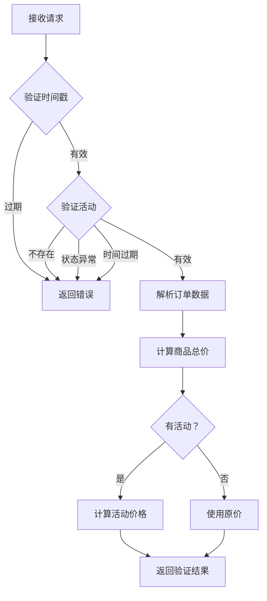

# 活动价格计算集成说明

## 📋 完成内容

### 1. 后端实现

#### 1.1 实体类
- ✅ [`ActivityConfig.java`](file:///d:/A/changmaozhanshichuoshuishuisi/src/main/java/com/pdd/mall/entity/ActivityConfig.java) - 活动配置实体
- ✅ [`ActivityConfigMapper.java`](file:///d:/A/changmaozhanshichuoshuishuisi/src/main/java/com/pdd/mall/mapper/ActivityConfigMapper.java) - 活动配置 Mapper
- ✅ [`ActivityConfigMapper.xml`](file:///d:/A/changmaozhanshichuoshuishuisi/src/main/resources/mapper/ActivityConfigMapper.xml) - MyBatis 配置

#### 1.2 服务层
- ✅ [`ActivityPriceCalculator.java`](file:///d:/A/changmaozhanshichuoshuishuisi/src/main/java/com/pdd/mall/service/ActivityPriceCalculator.java) - 活动价格计算器
  - `calculateActivityPrice()` - 计算单个活动价格
  - `calculateMultipleActivities()` - 计算多个活动价格（支持叠加）
  - `getDiscountAmount()` - 计算优惠金额

- ✅ [`ActivityValidationService.java`](file:///d:/A/changmaozhanshichuoshuishuisi/src/main/java/com/pdd/mall/service/ActivityValidationService.java) - 活动验证服务
  - `validateActivity()` - 验证活动有效性
  - `validateActivityPrice()` - 验证活动价格

#### 1.3 控制器
- ✅ [`OrderSettlementController.java`](file:///d:/A/changmaozhanshichuoshuishuisi/src/main/java/com/pdd/mall/controller/OrderSettlementController.java) - 订单结算验证接口
  - `POST /api/order/settlement/validate` - 验证订单并计算活动价格
  - `GET /api/order/settlement/activity/{activityId}` - 获取活动信息

#### 1.4 数据库
- ✅ [`activity_schema.sql`](file:///d:/A/changmaozhanshichuoshuishuisi/src/main/resources/sql/activity_schema.sql) - 活动表结构及测试数据

---

### 2. 前端集成

#### 2.1 商品详情页
- ✅ [`product-detail.html`](file:///d:/A/changmaozhanshichuoshuishuisi/src/main/resources/static/product-detail.html) - 传递活动参数
  - 立即购买时保留 URL 中的活动参数
  - 跳转到结算页时传递 `activityType` 和 `activityId`

#### 2.2 购物车页面
- ✅ [`cart.html`](file:///d:/A/changmaozhanshichuoshuishuisi/src/main/resources/static/cart.html) - 传递活动参数
  - 结算时检查 URL 中的活动参数
  - 跳转到结算页时传递活动参数

#### 2.3 结算页面
- ✅ [`checkout.html`](file:///d:/A/changmaozhanshichuoshuishuisi/src/main/resources/static/checkout.html) - 验证并显示活动优惠
  - `validateActivityWithBackend()` - 调用后端验证活动
  - `showActivityInfo()` - 显示活动优惠信息（原价、优惠金额、活动价）
  - 自动更新总价显示

---

## 🔧 使用方法

### 运维/运营配置活动

**方式一：数据库直接配置**
```sql
-- 满减活动：满 100 减 20
INSERT INTO activity_config (
    name, type, discount_rate, fixed_discount, min_amount,
    stackable, priority, status, start_time, end_time
) VALUES (
    '双 11 满减活动',
    1,              -- 类型：满减
    1.00,           -- 折扣系数：无
    20.00,          -- 固定减免：减 20 元
    100.00,         -- 最低消费：满 100 元
    0,              -- 不可叠加
    1,              -- 优先级：高
    1,              -- 状态：进行中
    '2025-11-01 00:00:00',
    '2025-11-11 23:59:59'
);

-- 折扣活动：9 折优惠
INSERT INTO activity_config (
    name, type, discount_rate, fixed_discount, min_amount,
    stackable, priority, status, start_time, end_time
) VALUES (
    '新用户 9 折优惠',
    2,              -- 类型：折扣
    0.90,           -- 折扣系数：9 折
    0.00,           -- 固定减免：无
    0.00,           -- 最低消费：无
    1,              -- 可叠加
    2,              -- 优先级：中
    1,              -- 状态：进行中
    '2025-01-01 00:00:00',
    '2025-12-31 23:59:59'
);
```

**方式二：调用 API**
```bash
POST /api/activity/config/add
Content-Type: application/json

{
    "name": "双 11 满减活动",
    "type": 1,
    "fixedDiscount": 20.00,
    "minAmount": 100.00,
    "startTime": "2025-11-01T00:00:00",
    "endTime": "2025-11-11T23:59:59"
}
```

### 前端跳转示例

**活动页面跳转到商品详情：**
```html
<!-- 活动 banner 点击跳转 -->
<div onclick="window.location.href='/product-detail.html?id=1&activityType=1&activityId=100'">
    <h2>双 11 特惠：满 100 减 20</h2>
</div>
```

**购物车页面（自动保留活动参数）：**
```javascript
// 如果用户从活动页面进入购物车，URL 会包含活动参数
// 例如：/cart.html?activityType=1&activityId=100
// 结算时会自动传递到结算页面
```

---

## 📊 计算逻辑

### 活动类型

| type 值 | 活动类型 | 计算方式 | 示例 |
|--------|---------|----------|------|
| 1 | 满减 | price - λ | 满 100 减 20 |
| 2 | 折扣 | price × ρ | 9 折 = price × 0.9 |
| 3 | 秒杀 | 固定秒杀价 | 原价 100，秒杀价 50 |
| 4 | 团购 | 根据人数阶梯定价 | 3 人团 8 折 |
| 5 | 优惠券 | price - λ 或 price × ρ | 满 200 减 50 |

### 计算公式

```
最终价格 = (商品原价 - 固定减免 λ) × 折扣系数 ρ
```

**计算示例：**
- 商品原价：100 元
- 满减活动：满 100 减 20（λ=20）
- VIP 折扣：9 折（ρ=0.9）
- **最终价格**：(100 - 20) × 0.9 = 72 元

---

## 🔍 验证流程

### 后端验证（OrderSettlementController）



### 前端验证（checkout.html）

```javascript
// 1. 从 URL 获取活动参数
const activityType = urlParams.get('activityType');
const activityId = urlParams.get('activityId');

// 2. 调用后端验证
fetch('/api/order/settlement/validate', {
    method: 'POST',
    body: JSON.stringify({
        userId: userId,
        orderData: orderData,
        activityId: activityId,
        activityType: activityType,
        timestamp: Date.now()
    })
})

// 3. 显示活动优惠
.then(result => {
    if (result.code === 200 && result.data.valid) {
        showActivityInfo(result.data);
        // 更新总价显示
        totalPriceElement.textContent = '¥' + result.data.finalTotal;
    }
});
```

---

## ✅ 测试用例

### 测试 1：满减活动

**请求：**
```json
POST /api/order/settlement/validate
{
    "userId": 1,
    "orderData": "[{\"productId\":1,\"price\":50,\"quantity\":3}]",
    "activityId": 1,
    "activityType": 1,
    "timestamp": 1775284382000
}
```

**预期响应：**
```json
{
    "code": 200,
    "data": {
        "valid": true,
        "originalTotal": 150.00,
        "activityId": 1,
        "activityType": 1,
        "finalTotal": 130.00,
        "discountAmount": 20.00
    }
}
```

### 测试 2：折扣活动

**请求：**
```json
{
    "userId": 1,
    "orderData": "[{\"productId\":1,\"price\":100,\"quantity\":1}]",
    "activityId": 2,
    "activityType": 2,
    "timestamp": 1775284382000
}
```

**预期响应：**
```json
{
    "code": 200,
    "data": {
        "valid": true,
        "originalTotal": 100.00,
        "activityId": 2,
        "activityType": 2,
        "finalTotal": 90.00,
        "discountAmount": 10.00
    }
}
```

### 测试 3：无活动

**请求：**
```json
{
    "userId": 1,
    "orderData": "[{\"productId\":1,\"price\":100,\"quantity\":1}]",
    "activityId": null,
    "activityType": null,
    "timestamp": 1775284382000
}
```

**预期响应：**
```json
{
    "code": 200,
    "data": {
        "valid": true,
        "originalTotal": 100.00,
        "finalTotal": 100.00
    }
}
```

---

## 🎯 功能特点

### 1. 安全性
- ✅ 时间戳验证（防重放攻击）
- ✅ 活动有效性验证
- ✅ 活动时间验证
- ✅ 活动状态验证

### 2. 灵活性
- ✅ 支持多种活动类型
- ✅ 支持活动叠加
- ✅ 支持优先级设置
- ✅ 支持最低消费金额

### 3. 用户体验
- ✅ 实时显示活动优惠
- ✅ 自动计算最终价格
- ✅ 清晰的价格明细
- ✅ 活动失效友好提示

---

## 📝 待改进项

- [ ] 添加订单数据签名验证
- [ ] 实现商品与活动匹配验证
- [ ] 实现用户参与条件验证
- [ ] 添加活动库存管理
- [ ] 添加订单超时取消机制
- [ ] 支持更多活动类型（拼团、秒杀等）

---

## 📚 相关文档

- [`活动系统框架说明.md`](file:///d:/A/changmaozhanshichuoshuishuisi/docs/活动系统框架说明.md) - 活动系统架构设计
- [`订单结算与活动验证说明.md`](file:///d:/A/changmaozhanshichuoshuishuisi/docs/订单结算与活动验证说明.md) - 订单结算验证机制

---

## 🎉 总结

**活动价格计算功能已完全集成！**

- ✅ 后端：活动配置、价格计算、验证接口
- ✅ 前端：参数传递、活动验证、价格显示
- ✅ 数据库：活动表结构、测试数据
- ✅ 文档：使用说明、测试用例

**运维/运营只需配置活动，用户从活动页面进入后，系统会自动计算优惠价格！**
