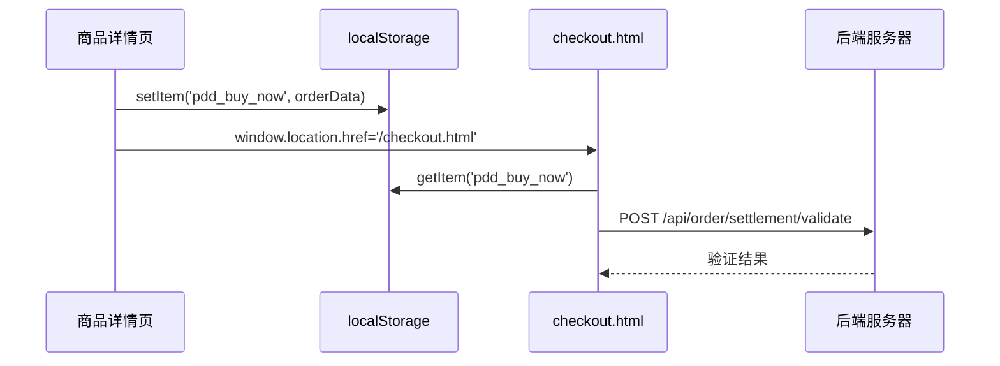
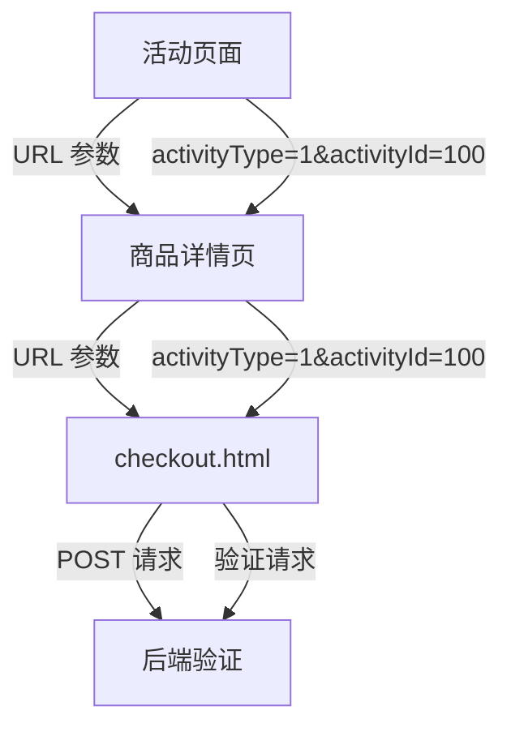
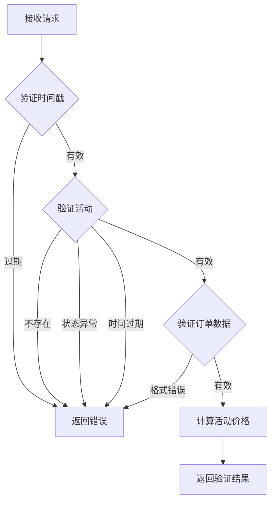

# 订单结算与活动验证机制说明

## 📋 目录
1. [localStorage 实现原理](#1-localstorage-实现原理)
2. [活动参数传递流程](#2-活动参数传递流程)
3. [服务器验证机制](#3-服务器验证机制)
4. [安全性保障](#4-安全性保障)
5. [运维接入指南](#5-运维接入指南)

---

## 1. localStorage 实现原理

### 1.1 数据存储结构

**商品详情页（product-detail.html）：**
```javascript
// 立即购买时保存的数据
localStorage.setItem('pdd_buy_now', JSON.stringify([{
    productId: 1,           // 商品 ID
    productName: "原味绿豆糕", // 商品名称
    price: 29.9,            // 商品价格
    taste: "原味",          // 口味
    spec: "标准装",         // 规格
    weight: "200g",         // 重量
    sugar: "正常甜度",      // 甜度
    coldChain: "常温",      // 配送方式
    quantity: 1,            // 数量
    image: "/api/image/file/1" // 商品图片
}]));
```

**购物车页面（cart.html）：**
```javascript
// 结算时保存的数据
localStorage.setItem('pdd_selected_order', JSON.stringify([{
    productId: 1,
    productName: "原味绿豆糕",
    price: 29.9,
    taste: "原味",
    spec: "标准装",
    quantity: 2,
    image: "/api/image/file/1"
}]));
```

### 1.2 数据传递流程



### 1.3 localStorage vs 服务器会话

**当前实现：**
- ✅ **优点**：
  - 简单直接，无需后端会话管理
  - 跨页面共享数据方便
  - 减少服务器压力
  
- ⚠️ **缺点**：
  - 数据存储在客户端，可能被篡改
  - 无法跨设备同步
  - 需要额外的签名验证机制

**与服务器会话的区别：**
| 特性 | localStorage | 服务器 Session |
|------|-------------|---------------|
| 存储位置 | 客户端浏览器 | 服务器内存/Redis |
| 安全性 | 较低（可被篡改） | 较高 |
| 性能 | 高（无需网络请求） | 中（需要查询） |
| 跨设备 | ❌ 不支持 | ✅ 支持 |
| 有效期 | 可设置（默认永久） | 服务器控制 |

---

## 2. 活动参数传递流程

### 2.1 参数传递路径



### 2.2 前端实现

**活动页面跳转示例：**
```html
<!-- 活动页面跳转到商品详情 -->
<a href="/product-detail.html?id=1&activityType=1&activityId=100">
    立即参与
</a>
```

**商品详情页传递参数：**
```javascript
// 立即购买时，保留活动参数
const urlParams = new URLSearchParams(window.location.search);
const activityType = urlParams.get('activityType');
const activityId = urlParams.get('activityId');

let redirectUrl = '/checkout.html?t=' + Date.now();
if (activityType && activityId) {
    redirectUrl += `&activityType=${activityType}&activityId=${activityId}`;
}
window.location.href = redirectUrl;
```

**结算页面接收参数：**
```javascript
// checkout.html 接收活动参数
const urlParams = new URLSearchParams(window.location.search);
const activityType = urlParams.get('activityType');
const activityId = urlParams.get('activityId');

window.currentActivity = {
    type: activityType ? parseInt(activityType) : null,
    id: activityId ? parseInt(activityId) : null
};
```

---

## 3. 服务器验证机制

### 3.1 验证接口

**API 端点：** `POST /api/order/settlement/validate`

**请求参数：**
```json
{
    "userId": 123,
    "orderData": "[{\"productId\":1,\"price\":29.9}]",
    "activityId": 100,
    "activityType": 1,
    "timestamp": 1775284382000
}
```

**验证流程：**


### 3.2 验证逻辑实现

**ActivityValidationService.java：**
```java
public boolean validateActivity(Long activityId) {
    if (activityId == null) {
        return true; // 没有活动
    }
    
    ActivityConfig activity = activityConfigMapper.findById(activityId);
    if (activity == null) {
        log.error("活动不存在：activityId={}", activityId);
        return false;
    }
    
    // 验证活动状态
    if (activity.getStatus() != 1) {
        log.error("活动状态异常：activityId={}, status={}", activityId, activity.getStatus());
        return false;
    }
    
    // 验证活动时间
    LocalDateTime now = LocalDateTime.now();
    if (now.isBefore(activity.getStartTime()) || now.isAfter(activity.getEndTime())) {
        log.error("活动已过期");
        return false;
    }
    
    return true;
}
```

### 3.3 价格计算验证

**验证公式：**
```
最终价格 = (商品原价 - 固定减免 λ) × 折扣系数 ρ
```

**示例：**
- 原价：100 元
- 满减活动：满 100 减 20（λ=20）
- VIP 折扣：9 折（ρ=0.9）
- 最终价格：(100 - 20) × 0.9 = 72 元

---

## 4. 安全性保障

### 4.1 防篡改机制

**问题：** localStorage 数据可能被用户篡改

**解决方案：**
1. **签名验证**（待实现）：
   ```javascript
   // 生成签名
   const sign = MD5(orderData + timestamp + serverSecret);
   
   // 后端验证签名
   if (!sign.equals(calculateSign(data))) {
       throw new SecurityException("数据可能被篡改");
   }
   ```

2. **服务器价格验证**：
   ```java
   // 从数据库查询真实价格
   Product product = productMapper.findById(productId);
   if (!inputPrice.equals(product.getPrice())) {
       throw new SecurityException("价格不匹配");
   }
   ```

### 4.2 防重放攻击

**时间戳验证：**
```java
long now = System.currentTimeMillis();
long diff = now - dto.getTimestamp();
if (diff > 5 * 60 * 1000) { // 5 分钟有效期
    return Result.error("请求已过期");
}
```

### 4.3 活动验证

**多重验证：**
1. ✅ 活动是否存在
2. ✅ 活动状态是否正常（1-进行中）
3. ✅ 活动时间是否有效
4. ✅ 活动与商品是否匹配（待实现）
5. ✅ 用户是否符合参与条件（待实现）

---

## 5. 运维接入指南

### 5.1 创建活动

**方式一：数据库直接配置**
```sql
INSERT INTO activity_config (
    name, type, discount_rate, fixed_discount,
    start_time, end_time, status, priority
) VALUES (
    '双 11 满减活动',
    1,              -- 类型：满减
    1.0,            -- 折扣系数：无
    20.00,          -- 固定减免：满 100 减 20
    '2025-11-01 00:00:00',
    '2025-11-11 23:59:59',
    1,              -- 状态：进行中
    1               -- 优先级：高
);
```

**方式二：调用 API**
```bash
POST /api/activity/config/add
Content-Type: application/json

{
    "name": "双 11 满减活动",
    "type": 1,
    "fixedDiscount": 20,
    "minAmount": 100,
    "startTime": "2025-11-01T00:00:00",
    "endTime": "2025-11-11T23:59:59"
}
```

### 5.2 前端跳转示例

**活动页面 HTML：**
```html
<!-- 活动 banner 点击跳转 -->
<div onclick="window.location.href='/product-detail.html?id=1&activityType=1&activityId=100'">
    <h2>双 11 特惠：满 100 减 20</h2>
</div>
```

### 5.3 验证活动配置

**测试接口：**
```bash
GET /api/activity/test/calculate?originalPrice=100&activityId=100
```

**预期响应：**
```json
{
    "code": 200,
    "data": {
        "originalPrice": 100,
        "finalPrice": 80,
        "activityName": "双 11 满减活动"
    }
}
```

---

## 6. 常见问题

### Q1: localStorage 数据会被清除吗？
**A:** 用户清除浏览器缓存时会被清除，但不影响正常使用（只是会丢失未完成的订单）。

### Q2: 如何防止用户修改 localStorage 数据？
**A:** 
1. 使用签名验证（待实现）
2. 服务器端重新计算价格
3. 关键数据（如价格）以服务器为准

### Q3: 活动参数丢失怎么办？
**A:** 
1. 前端会调用后端验证，如果活动失效会提示用户
2. 用户可以正常购买，只是不享受活动优惠

### Q4: 多个活动可以叠加吗？
**A:** 
- 取决于活动配置的 `stackable` 字段
- 系统支持叠加计算，但需要运维配置

---

## 7. 待改进项

- [ ] 添加订单数据签名验证
- [ ] 实现商品与活动匹配验证
- [ ] 实现用户参与条件验证
- [ ] 添加购物车数据库持久化
- [ ] 实现活动库存管理
- [ ] 添加订单超时取消机制

---

## 8. 总结

**当前实现：**
- ✅ localStorage 存储订单数据（简单高效）
- ✅ URL 参数传递活动信息
- ✅ 后端验证活动有效性
- ✅ 时间戳防重放攻击
- ⏳ 签名验证（待实现）
- ⏳ 服务器价格校验（待实现）

**安全性：**
- 基础验证已完成，可以防止明显的配置错误
- 对于恶意篡改，需要 additional 签名验证和服务器校验

**运维接入：**
- 参考 [`活动系统框架说明.md`](./活动系统框架说明.md)
- 配置活动后，前端自动识别并应用优惠
