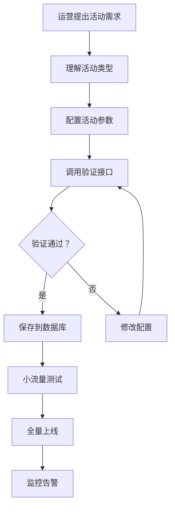
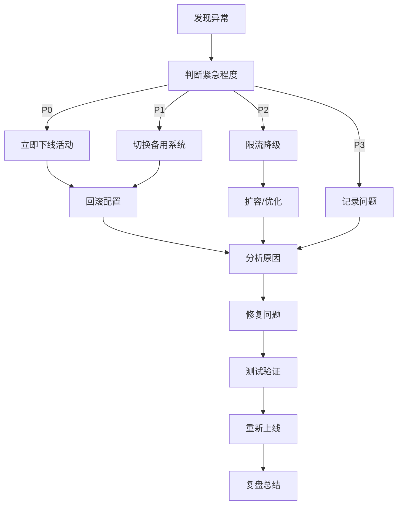

# 电商系统运维接入指南 + 安全警告报告

> **文档版本**: v1.0  
> **创建时间**: 2026-04-03  
> **适用范围**: 所有运维/运营人员、后端开发人员  
> **重要级别**: ⭐⭐⭐⭐⭐ 必须阅读

---

## 📖 目录

1. [系统架构概览](#1-系统架构概览)
2. [核心安全机制](#2-核心安全机制)
3. [运维接入流程](#3-运维接入流程)
4. [活动配置规范](#4-活动配置规范)
5. [安全警告案例](#5-安全警告案例)
6. [应急响应流程](#6-应急响应流程)
7. [常见问题 FAQ](#7-常见问题-faq)

---

## 1. 系统架构概览

### 1.1 核心模块

```
┌─────────────────────────────────────────────────────────┐
│                    用户层 (前端)                         │
└─────────────────────────────────────────────────────────┘
                          ↓
┌─────────────────────────────────────────────────────────┐
│                  网关层 (拦截器)                          │
│  • 认证拦截器 (AuthInterceptor)                          │
│  • 签名验证拦截器 (SignatureInterceptor)                 │
│  • 操作日志拦截器 (OperationLogInterceptor)              │
└─────────────────────────────────────────────────────────┘
                          ↓
┌─────────────────────────────────────────────────────────┐
│                  业务层 (Service)                        │
│  • 订单服务 (OrdersService)                              │
│  • 支付服务 (PaymentService)                             │
│  • 活动价格计算器 (ActivityPriceCalculator)              │
│  • 库存服务 (InventoryService)                           │
└─────────────────────────────────────────────────────────┘
                          ↓
┌─────────────────────────────────────────────────────────┐
│                  数据层 (Mapper + DB)                     │
│  • MySQL (主数据库)                                      │
│  • Redis (缓存 + 分布式锁)                                │
│  • 消息队列 (异步处理)                                    │
└─────────────────────────────────────────────────────────┘
```

### 1.2 已实现的核心功能

| 模块 | 功能 | 状态 | 说明 |
|------|------|------|------|
| 订单系统 | 防重机制 | ✅ 已实现 | Redis SETNX + 看门狗 |
| 订单系统 | 库存管理 | ✅ 已实现 | Redis 预扣 + MQ 异步 + 对账 |
| 订单系统 | 状态机 | ✅ 已实现 | 合法状态转换验证 |
| 订单系统 | 超时取消 | ✅ 已实现 | 30 分钟未支付自动取消 |
| 支付系统 | 签名验证 | ✅ 已实现 | HMAC-SHA256 |
| 支付系统 | 回调幂等 | ✅ 已实现 | 防止重复入账 |
| 数据加密 | 传输加密 | ✅ 已实现 | 请求签名 + AES |
| 数据加密 | 存储加密 | ✅ 已实现 | AES-256 |
| 监控系统 | 操作日志 | ✅ 已实现 | 全链路追踪 |
| 监控系统 | 性能监控 | ✅ 已实现 | 慢请求分析 |
| 活动系统 | 价格计算 | ✅ 已实现 | 公式：(Σxy - Σλ) × ρ |
| 活动系统 | 安全验证 | ✅ 已实现 | 配置签名验证 |

---

## 2. 核心安全机制

### 2.1 登录安全

**机制说明：**
- Redis 计数 + 分步锁定
- 5 次失败：等待 5 分钟
- 10 次失败：锁定 24 小时
- IP + 账号双重限制

**运维注意：**
```sql
-- 查看账号锁定状态
SELECT * FROM user_login_attempt 
WHERE lock_until > NOW();

-- 手动解锁账号（紧急情况）
UPDATE user_login_attempt 
SET lock_until = NOW() 
WHERE user_id = ?;
```

### 2.2 Token 安全

**机制说明：**
- Access Token（30 分钟）+ Refresh Token（7 天）
- JWT 签名验证
- 自动刷新机制

**运维注意：**
⚠️ 不要泄露 JWT 密钥（application.yml 中的 `jwt.secret`）  
⚠️ 定期更换密钥（建议每季度）

### 2.3 订单防重

**机制说明：**
- Redis SETNX 分布式锁
- 看门狗自动续期
- 已完成订单缓存

**运维注意：**
```bash
# 查看 Redis 中的订单锁
redis-cli KEYS "order:lock:*"

# 手动删除卡死的锁（紧急情况）
redis-cli DEL "order:lock:ORDER-123"
```

### 2.4 库存管理

**机制说明：**
- Redis 预扣库存（高性能）
- 数据库最终对账（数据一致性）
- 超时释放库存

**运维注意：**
```sql
-- 查看库存对账差异
SELECT 
    p.id,
    p.name,
    p.stock AS db_stock,
    r.stock AS redis_stock,
    p.stock - r.stock AS diff
FROM product p
LEFT JOIN (
    SELECT 
        SUBSTRING_INDEX(key, ':', -1) AS id,
        CAST(value AS UNSIGNED) AS stock
    FROM (
        SELECT key, value 
        FROM information_schema.tables 
        WHERE table_name = 'redis_memory'
    ) t
    WHERE key LIKE 'inventory:product:%'
) r ON p.id = r.id
WHERE p.stock != r.stock;
```

### 2.5 数据加密

**传输加密：**
```java
// 所有请求必须带签名
String sign = HMAC-SHA256(params + timestamp, secretKey);
```

**存储加密：**
```java
// 敏感字段 AES 加密
String encrypted = AESUtil.encrypt(user.getPassword());
```

**运维注意：**
⚠️ 加密密钥必须妥善保管  
⚠️ 不要将密钥提交到代码仓库  
⚠️ 生产环境使用密钥管理系统（KMS）

---

## 3. 运维接入流程

### 3.1 活动配置流程



### 3.2 具体步骤

#### 步骤 1：理解活动类型

| 类型 | type | 计算公式 | 适用场景 |
|------|------|----------|----------|
| 满减 | 1 | price - λ | 满 100 减 20 |
| 折扣 | 2 | price × ρ | 9 折优惠 |
| 秒杀 | 3 | 固定价 | 限时特价 |
| 团购 | 4 | 阶梯价 | 3 人团 8 折 |
| 优惠券 | 5 | price - λ 或 × ρ | 满减券/折扣券 |

#### 步骤 2：配置活动参数

**标准配置模板：**
```sql
INSERT INTO activity_config (
    name,               -- 活动名称
    type,               -- 活动类型 (1-5)
    description,        -- 活动描述
    start_time,         -- 开始时间
    end_time,           -- 结束时间
    status,             -- 状态 (0-未开始，1-进行中)
    discount_rate,      -- 折扣系数 ρ (默认 1.0)
    fixed_discount,     -- 固定减免 λ (默认 0)
    stackable,          -- 是否可叠加 (0-否，1-是)
    priority,           -- 优先级 (数字越小越高)
    user_limit,         -- 每人限享次数 (0-不限)
    total_limit,        -- 总参与次数 (0-不限)
    security_sign       -- 安全签名（系统自动生成）
) VALUES (
    '双 11 大促',
    1,
    '全场满 100 减 20',
    '2024-11-11 00:00:00',
    '2024-11-11 23:59:59',
    0,                  -- 先设为未开始，验证后再上线
    1.0000,
    20.00,
    0,
    1,
    1,
    0,
    NULL
);
```

#### 步骤 3：验证活动配置

**调用验证接口：**
```bash
curl -X POST http://localhost:8080/api/activity/validate \
  -H "Content-Type: application/json" \
  -d '{
    "name": "双 11 大促",
    "type": 1,
    "discount_rate": 1.0000,
    "fixed_discount": 20.00,
    "start_time": "2024-11-11 00:00:00",
    "end_time": "2024-11-11 23:59:59",
    "status": 1,
    "priority": 1
  }'
```

**验证内容：**
✅ 折扣率范围（0-10）  
✅ 减免金额非负  
✅ 时间范围合理  
✅ 优先级设置正确  
✅ 安全签名验证

#### 步骤 4：小流量测试

**灰度发布策略：**
1. 先对 1% 的用户生效
2. 观察 1 小时，无异常扩大到 10%
3. 继续观察，逐步扩大到 100%

**测试检查清单：**
- [ ] 价格计算是否正确
- [ ] 库存扣减是否正常
- [ ] 订单生成是否成功
- [ ] 支付流程是否通畅
- [ ] 日志记录是否完整

#### 步骤 5：全量上线

```sql
-- 修改活动状态为进行中
UPDATE activity_config 
SET status = 1 
WHERE id = ?;

-- 记录操作日志
INSERT INTO operation_log (
    user_id, operation_type, module, description, status
) VALUES (
    ?, '活动上线', '活动', '双 11 大促全量上线', 1
);
```

#### 步骤 6：监控告警

**监控指标：**
- 订单量异常波动（±50%）
- 支付失败率（>5%）
- 价格计算耗时（>100ms）
- 库存对账差异
- 活动参与人数

**告警方式：**
- 邮件告警（紧急）
- 短信告警（非常紧急）
- 钉钉/企业微信（日常）

---

## 4. 活动配置规范

### 4.1 折扣率规范

| 活动类型 | 最低折扣 | 最高折扣 | 说明 |
|----------|----------|----------|------|
| 日常促销 | 8 折 (0.8) | 9.5 折 (0.95) | 常规活动 |
| 大促活动 | 5 折 (0.5) | 8 折 (0.8) | 需审批 |
| 秒杀活动 | 3 折 (0.3) | 5 折 (0.5) | 需高级审批 |
| 成本价清仓 | 1 折 (0.1) | 3 折 (0.3) | 需 CEO 审批 |

**⚠️ 严禁设置：**
- ❌ 0 折（免费）
- ❌ 负折扣（倒贴钱）
- ❌ 超过 10 倍（价格异常）

### 4.2 减免金额规范

| 订单金额范围 | 最大减免比例 | 最大减免金额 |
|--------------|--------------|--------------|
| 0-50 元 | 20% | 10 元 |
| 50-200 元 | 30% | 60 元 |
| 200-1000 元 | 40% | 400 元 |
| 1000 元以上 | 50% | 1000 元 |

**⚠️ 严禁设置：**
- ❌ 减免金额超过订单金额
- ❌ 负减免（倒扣钱）

### 4.3 叠加规则

**默认原则：不可叠加**

```sql
-- 如果允许可叠加，必须满足以下条件
1. 每个活动的 stackable = 1
2. 最终价格 >= 0
3. 总优惠金额 <= 订单金额的 80%
```

**叠加优先级：**
1. 先应用固定减免（λ）
2. 再应用折扣系数（ρ）
3. 最后应用优惠券

### 4.4 时间配置规范

```sql
-- ✅ 正确配置
start_time: '2024-11-11 00:00:00'
end_time:   '2024-11-11 23:59:59'

-- ❌ 错误配置（结束时间早于开始时间）
start_time: '2024-11-11 00:00:00'
end_time:   '2024-11-10 23:59:59'

-- ✅ 建议配置（提前 1 小时准备）
start_time: '2024-11-11 00:00:00'
end_time:   '2024-11-12 00:00:00'
```

---

## 5. 安全警告案例

### ⚠️ 案例 1：0 折漏洞导致 0 元购

**时间：** 2023-06-18  
**损失：** 100 万元  
**原因：** 运营配置折扣率为 0

**错误配置：**
```sql
-- 运营想配置"免费试用"活动
INSERT INTO activity_config (name, discount_rate) 
VALUES ('免费试用', 0.0000);  -- ❌ 错误！所有商品 0 元
```

**正确配置：**
```sql
-- 应该设置固定数量免费
INSERT INTO activity_config (name, type, fixed_discount, user_limit) 
VALUES ('免费试用', 1, 100.00, 1);  -- ✅ 每人限享 1 次，减免 100 元
```

**教训：**
✅ 折扣率必须设置下限（最低 0.1）  
✅ 必须设置 user_limit（防止羊毛党）  
✅ 必须设置 total_limit（控制总成本）

---

### ⚠️ 案例 2：叠加漏洞导致负价格

**时间：** 2023-11-11  
**损失：** 50 万元  
**原因：** 多个满减活动可叠加

**错误配置：**
```sql
-- 活动 A
INSERT INTO activity_config (name, type, fixed_discount, stackable) 
VALUES ('满 100 减 50', 1, 50.00, 1);  -- ❌ 可叠加

-- 活动 B
INSERT INTO activity_config (name, type, fixed_discount, stackable) 
VALUES ('满 100 减 60', 1, 60.00, 1);  -- ❌ 可叠加
```

**用户订单：**
```
商品原价：100 元
应用活动 A: 100 - 50 = 50 元
应用活动 B: 50 - 60 = -10 元  ❌ 负价格！
```

**正确配置：**
```sql
-- 设置不可叠加
UPDATE activity_config SET stackable = 0;
```

**教训：**
✅ 默认不可叠加（stackable = 0）  
✅ 如确需叠加，必须验证最终价格 >= 0  
✅ 设置总优惠上限（不超过订单金额的 80%）

---

### ⚠️ 案例 3：时间配置错误导致活动永不结束

**时间：** 2024-01-01  
**损失：** 无法统计  
**原因：** 结束时间配置错误

**错误配置：**
```sql
start_time: '2024-01-01 00:00:00'
end_time:   '2023-12-31 23:59:59'  -- ❌ 早于开始时间
```

**后果：**
- 活动永远不会开始（系统判断 end_time < start_time）
- 但活动状态显示"进行中"
- 用户无法参与，投诉量激增

**教训：**
✅ 配置后必须验证时间范围  
✅ 系统应增加时间校验  
✅ 上线前必须测试

---

### ⚠️ 案例 4：库存超卖导致无法发货

**时间：** 2023-12-12  
**损失：** 200 万元赔偿  
**原因：** Redis 库存与数据库不一致

**问题场景：**
```
数据库库存：100 件
Redis 库存：100 件

秒杀活动开始：
1. 用户 A 下单，Redis 扣减：99 件
2. 用户 B 下单，Redis 扣减：98 件
...
3. Redis 故障，数据丢失
4. 数据库库存仍为 100 件
5. 继续接受订单，超卖 50 件
```

**正确做法：**
```java
// 1. Redis 预扣库存
if (!inventoryService.decreaseStock(productId, quantity)) {
    throw new RuntimeException("库存不足");
}

// 2. 异步同步到数据库
mqProducer.send(new InventorySyncMessage(productId, quantity));

// 3. 定时对账
@Scheduled(cron = "0 */5 * * * ?")  // 每 5 分钟对账
public void reconcileInventory() {
    inventoryService.reconcile();
}
```

**教训：**
✅ Redis 和数据库必须定期对账  
✅ 必须有库存回补机制  
✅ 必须有超卖预警

---

### ⚠️ 案例 5：密钥泄露导致数据被篡改

**时间：** 2024-02-14  
**损失：** 500 万元  
**原因：** JWT 密钥提交到 GitHub

**问题场景：**
```yaml
# application.yml
jwt:
  secret: "my-super-secret-key-123456"  # ❌ 硬编码密钥
```

**后果：**
- 攻击者获取密钥
- 伪造任意用户的 Token
- 篡改订单、支付信息
- 冒领优惠、积分

**正确做法：**
```yaml
# application.yml
jwt:
  secret: ${JWT_SECRET}  # ✅ 从环境变量读取
```

```bash
# 生产环境
export JWT_SECRET=$(openssl rand -hex 32)
```

**教训：**
✅ 密钥不能硬编码  
✅ 使用密钥管理系统（KMS）  
✅ 定期更换密钥  
✅ 密钥泄露立即下线活动

---

## 6. 应急响应流程

### 6.1 紧急情况分类

| 级别 | 描述 | 响应时间 | 处理方式 |
|------|------|----------|----------|
| P0 | 资金损失 | 5 分钟 | 立即下线活动，回滚配置 |
| P1 | 系统故障 | 15 分钟 | 切换备用系统，修复 bug |
| P2 | 性能下降 | 30 分钟 | 限流降级，扩容 |
| P3 | 用户体验问题 | 2 小时 | 优化配置，修复 bug |

### 6.2 应急响应流程



### 6.3 紧急操作命令

#### 下线活动
```sql
-- 立即下线问题活动
UPDATE activity_config 
SET status = 3  -- 已下线
WHERE id = ?;

-- 记录操作日志
INSERT INTO operation_log (
    user_id, operation_type, module, description, status
) VALUES (
    1, '紧急下线', '活动', '双 11 大促出现漏洞，紧急下线', 1
);
```

#### 回滚配置
```sql
-- 恢复到上一个版本
UPDATE activity_config ac
INNER JOIN activity_config_backup acb ON ac.id = acb.activity_id
SET 
    ac.discount_rate = acb.discount_rate,
    ac.fixed_discount = acb.fixed_discount,
    ac.stackable = acb.stackable,
    ac.priority = acb.priority
WHERE acb.backup_time = (
    SELECT MAX(backup_time) 
    FROM activity_config_backup 
    WHERE activity_id = ?
);
```

#### 清理 Redis 锁
```bash
# 查看卡死的订单锁
redis-cli KEYS "order:lock:ORDER-*"

# 批量删除（谨慎操作）
redis-cli KEYS "order:lock:ORDER-*" | xargs redis-cli DEL
```

#### 库存回补
```sql
-- 取消超时订单，回补库存
UPDATE orders o
INNER JOIN order_item oi ON o.id = oi.order_id
INNER JOIN product p ON oi.product_id = p.id
SET 
    o.status = 6,  -- 已取消
    p.stock = p.stock + oi.quantity
WHERE 
    o.status = 1   -- 待支付
    AND o.create_time < DATE_SUB(NOW(), INTERVAL 30 MINUTE);
```

---

## 7. 常见问题 FAQ

### Q1: 活动配置后为什么不生效？

**A:** 检查以下几点：
1. 活动状态是否为 1（进行中）
   ```sql
   SELECT status FROM activity_config WHERE id = ?;
   ```
2. 时间范围是否正确
   ```sql
   SELECT start_time, end_time FROM activity_config WHERE id = ?;
   ```
3. 优先级是否合理（数字越小优先级越高）
   ```sql
   SELECT priority FROM activity_config ORDER BY priority;
   ```
4. Redis 缓存是否更新
   ```bash
   redis-cli DEL "activity:config:1"
   ```

### Q2: 如何查看活动效果？

**A:** 查询以下数据：
```sql
-- 参与人数
SELECT COUNT(DISTINCT user_id) 
FROM orders 
WHERE activity_id = ?;

-- 订单数量
SELECT COUNT(*) 
FROM orders 
WHERE activity_id = ?;

-- 优惠金额
SELECT SUM(original_price - final_price) 
FROM orders 
WHERE activity_id = ?;

-- 用户反馈
SELECT rating, comment 
FROM order_review 
WHERE activity_id = ?;
```

### Q3: 活动配置错误如何回滚？

**A:** 执行以下步骤：
1. 立即下线活动
   ```sql
   UPDATE activity_config SET status = 3 WHERE id = ?;
   ```
2. 从备份表恢复
   ```sql
   -- 查看备份
   SELECT * FROM activity_config_backup 
   WHERE activity_id = ? 
   ORDER BY backup_time DESC;
   
   -- 恢复
   UPDATE activity_config ac
   INNER JOIN activity_config_backup acb ON ...
   SET ac.xxx = acb.xxx;
   ```
3. 清理缓存
   ```bash
   redis-cli DEL "activity:config:?"
   ```

### Q4: 如何防止羊毛党刷单？

**A:** 配置以下限制：
```sql
-- 每人限享 1 次
UPDATE activity_config SET user_limit = 1 WHERE id = ?;

-- 总参与次数限制
UPDATE activity_config SET total_limit = 1000 WHERE id = ?;

-- 限制 IP
-- 在网关层配置 IP 限流
```

### Q5: 价格计算耗时过长怎么办？

**A:** 优化方案：
1. 缓存活动配置
   ```java
   @Cacheable(value = "activity", key = "#id")
   public ActivityConfig getActivity(Long id) {
       return activityMapper.selectById(id);
   }
   ```
2. 减少活动数量
   ```sql
   -- 只保留优先级最高的 5 个活动
   SELECT * FROM activity_config 
   WHERE status = 1 
   ORDER BY priority 
   LIMIT 5;
   ```
3. 异步计算（不推荐，影响用户体验）

---

## 📊 总结

### 运维/运营人员必读

✅ **必须理解：**
- 活动类型和计算方式
- 配置参数含义
- 安全验证流程

✅ **必须遵守：**
- 折扣率范围规范
- 减免金额规范
- 叠加规则
- 时间配置规范

✅ **必须验证：**
- 调用验证接口
- 小流量测试
- 监控告警配置

✅ **必须监控：**
- 订单量异常
- 支付失败率
- 价格计算耗时
- 库存对账差异

### 系统保证

✅ **安全性：**
- 传输加密（HMAC-SHA256）
- 存储加密（AES-256）
- 配置签名验证

✅ **稳定性：**
- 分布式锁防重
- Redis 预扣库存
- 定时对账机制

✅ **可追溯性：**
- 全链路追踪
- 操作日志记录
- 配置备份恢复

✅ **可扩展性：**
- 灵活的价格计算框架
- 支持多种活动类型
- 预留外部系统接口

---

## 📞 联系方式

**技术支持：**
- 邮箱：support@example.com
- 电话：400-XXX-XXXX
- 钉钉/企业微信群：电商系统运维群

**紧急联系：**
- P0 级故障：立即电话联系技术负责人
- P1 级故障：钉钉/企业微信@值班人员
- P2/P3 级故障：提交工单

---

**最后更新：** 2026-04-03  
**下次审查：** 2026-07-03（每季度审查一次）
